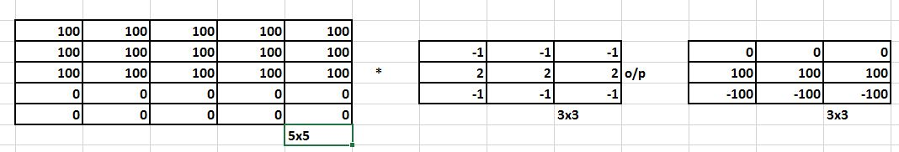
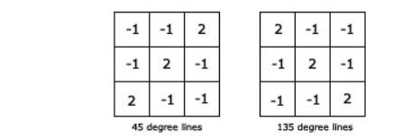
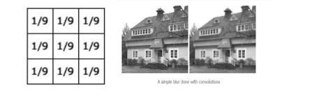
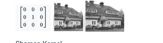
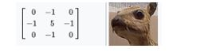

**Kernels**  
The first layer in a CNN is always a Convolutional Layer. We know that input is a 32 x 32 x 3 array of pixel values. Now conv layer is to imagine a flashlight that is shining over the top left of the image. Let’s say that the light this flashlight shines covers a 5 x 5 area. And now, let’s imagine this flashlight sliding across all the areas of the input image. This flashlight is called a filter or  kernel.
 Human brain protectives we have 4 core layers. The first layer neurons in our brain extract edges. Their role is equal to the role of "kernels" or "filters" or "3x3 matrix"

 
 **Channels** 
Gray scale image, that means we are getting data from one sensor. If we have an RGB image it means we are getting data from three sensors. If you have a CMYK image that means we are getting data from four sensors.
 The layers operate on 3-D chunks of data, where the first two dimensions are the height and width of an image and the third dimension is a number of such patches stacked over one another, which is also called the number of channels in the image volume. we can be viewed as a H×W×C vector, where H,W are the dimensions of the image and C is the number of channels of the given image volume.
 We have image text suppose “I” so  look at only "I"s in the image. See what color they are and what is their size. That “I” channel for us

 
 <b>Why should we only (well mostly) use 3x3 Kernels?</b> 
A convolution filter passes over all the pixels of the image in such a manner that at a given time we take 'dot product' of the convolution filter and the image pixels to get one final value output. We can think of each convolution filter as extracting some kind of feature from the image
 If we apply 3x3 kernel twice to get a final value, we actually used (3x3 + 3x3) weights. So, with smaller kernel sizes, we get lower number of weights and more number of layers. Due to the lower number of weights, this is computationally efficient. 
If we apply 5x5 kernel once, we actually used 25 (5x5) weights. So, with larger kernel sizes, we get a higher number of weights but lower number of layers. 
 3x3 kernels repeated many times will give us any size we want (odd sized only). Reason we do not want an even sized is that there is no line of symmetry in even numbers. We need to know the central line to create concepts of left and right with a distinguishable central line.

 <b>How many times do we need to perform 3x3 convolution operation to reach 1x1 from 199x199 (show calculations)</b> 

| SlNo | Input Image Matrix | Convolution | Karnel/Filter | Output Image Matrix |
| --- | --- |--- | --- |--- |
|1	|199x199	|*|	3x3|	197x197|
|2	|197x197	|*|	3x3|	195x195|
|3	|195x195	|*|	3x3|	193x193|
|4	|193x193	|*|	3x3|	191x191|
|5	|191x191	|*|	3x3|	189x189|
|6	|189x189	|*|	3x3|	187x187|
|7	|187x187	|*|	3x3|	185x185|
|8	|185x185	|*|	3x3|	183x183|
|9	|183x183	|*|	3x3|	181x181|
|10	|181x181	|*|	3x3|	179x179|
|11	|179x179	|*|	3x3|	177x177|
|12	|177x177	|*|	3x3|	175x175|
|13	|175x175	|*|	3x3|	173x173|
|14	|173x173	|*|	3x3|	171x171|
|15	|171x171	|*|	3x3|	169x169|
|16	|169x169	|*|	3x3|	167x167|
|17	|167x167	|*|	3x3|	165x165|
|18	|165x165	|*|	3x3|	163x163|
|19	|163x163	|*|	3x3|	161x161|
|20	|161x161	|*|	3x3|	159x159|
|21	|159x159	|*|	3x3|	157x157|
|22	|157x157	|*|	3x3|	155x155|
|23	|155x155	|*|	3x3|	153x153|
|24	|153x153	|*|	3x3|	151x151|
|25	|151x151	|*|	3x3|	149x149|
|26	|149x149	|*|	3x3|	147x147|
|27	|147x147	|*|	3x3|	145x145|
|28	|145x145	|*|	3x3|	143x143|
|29	|143x143	|*|	3x3|	141x141|
|30	|141x141	|*|	3x3|	139x139|
|31	|139x139	|*|	3x3|	137x137|
|32	|137x137	|*|	3x3|	135x135|
|33	|135x135	|*|	3x3|	133x133|
|34	|133x133	|*|	3x3|	131x131|
|35	|131x131	|*|	3x3|	129x129|
|36	|129x129	|*|	3x3|	127x127|
|37	|127x127	|*|	3x3|	125x125|
|38	|125x125	|*|	3x3|	123x123|
|39	|123x123	|*|	3x3|	121x121|
|40	|121x121	|*|	3x3|	119x119|
|41	|119x119	|*|	3x3|	117x117|
|42	|117x117	|*|	3x3|	115x115|
|43	|115x115	|*|	3x3|	113x113|
|44	|113x113	|*|	3x3|	111x111|
|45	|111x111	|*|	3x3|	109x109|
|46	|109x109	|*|	3x3|	107x107|
|47	|107x107	|*|	3x3|	105x105|
|48	|105x105	|*|	3x3|	103x103|
|49	|103x103	|*|	3x3|	101x101|
|50	|101x101	|*|	3x3|	99x99|
|51	|99x99	|*|	3x3|	97x97|
|52	|97x97	|*|	3x3|	95x95|
|53	|95x95	|*|	3x3|	93x93|
|54	|93x93	|*|	3x3|	91x91|
|55	|91x91	|*|	3x3|	89x89|
|56	|89x89	|*|	3x3|	87x87|
|57	|87x87	|*|	3x3|	85x85|
|58	|85x85	|*|	3x3|	83x83|
|59	|83x83	|*|	3x3|	81x81|
|60	|81x81	|*|	3x3|	79x79|
|61	|79x79	|*|	3x3|	77x77|
|62	|77x77	|*|	3x3|	75x75|
|63	|75x75	|*|	3x3|	73x73|
|64	|73x73	|*|	3x3|	71x71|
|65	|71x71	|*|	3x3|	69x69|
|66	|69x69	|*|	3x3|	67x67|
|67	|67x67	|*|	3x3|	65x65|
|68	|65x65	|*|	3x3|	63x63|
|69	|63x63	|*|	3x3|	61x61|
|70	|61x61	|*|	3x3|	59x59|
|71	|59x59	|*|	3x3|	57x57|
|72	|57x57	|*|	3x3|	55x55|
|73	|55x55	|*|	3x3|	53x53|
|74	|53x53	|*|	3x3|	51x51|
|75	|51x51	|*|	3x3|	49x49|
|76	|49x49	|*|	3x3|	47x47|
|77	|47x47	|*|	3x3|	45x45|
|78	|45x45	|*|	3x3|	43x43|
|79	|43x43	|*|	3x3|	41x41|
|80	|41x41	|*|	3x3|	39x39|
|81	|39x39	|*|	3x3|	37x37|
|82	|37x37	|*|	3x3|	35x35|
|83	|35x35	|*|	3x3|	33x33|
|84	|33x33	|*|	3x3|	31x31|
|85	|31x31	|*|	3x3|	29x29|
|86	|29x29	|*|	3x3|	27x27|
|87	|27x27	|*|	3x3|	25x25|
|88	|25x25	|*|	3x3|	23x23|
|89	|23x23	|*|	3x3|	21x21|
|90	|21x21	|*|	3x3|	19x19|
|91	|19x19	|*|	3x3|	17x17|
|92	|17x17	|*|	3x3|	15x15|
|93	|15x15	|*|	3x3|	13x13|
|94	|13x13	|*|	3x3|	11x11|
|95	|11x11	|*|	3x3|	9x9|
|96	|9x9	|*|	3x3|	7x7|
|97	|7x7	|*|	3x3|	5x5|
|98	|5x5	|*|	3x3|	3x3|
|99	|3x3	|*|	3x3|	1x1|
			
			
  <b>Horizontal Edge Detector</b> 
		
	

So our first row is black and second row is white ,so our edge is black to white . Third row also denote white .

  <b>45 Degree Angle Detector (either)</b> 

 When Boundaries between objects its called Edges.
  Left corner and down right corner act as a engle between dark and white line for 45 degee Edge.

  <b>Blur Kernel</b> 

 This is the important if the sum is not exactly one, the resultant image will be brighter or darker. 

  <b>Identity function (doesn't do anything)</b> 			

 After apply filter image don’t have any changes then its called identity function.
    
  <b>Sharpen Kernel</b> 

  Sharpening an image add contrast to edges, and a 3x3 version of this mask is similar to the edge detection kernel with a center value of 5. This adds contrast around an edge by accentuating bright and dark areas.
 			
			
			
			
			
			
			
			
			
			
			
			
			
			
			
			
			
			
			
			
			
			
			
			
			
			
			
			
			
			
			
			
			
			
			
			
			
			
			
			
			
			
			
			
			
			
			
			
			
			
			
			
			
			
			
			
			
			
			
			
			
			
			
			
			
			
			
			
			
			
			
			
			
			
			
			
			
			
			
			
			
			
			
			
			
			
			
			
			
			
			
			
			

